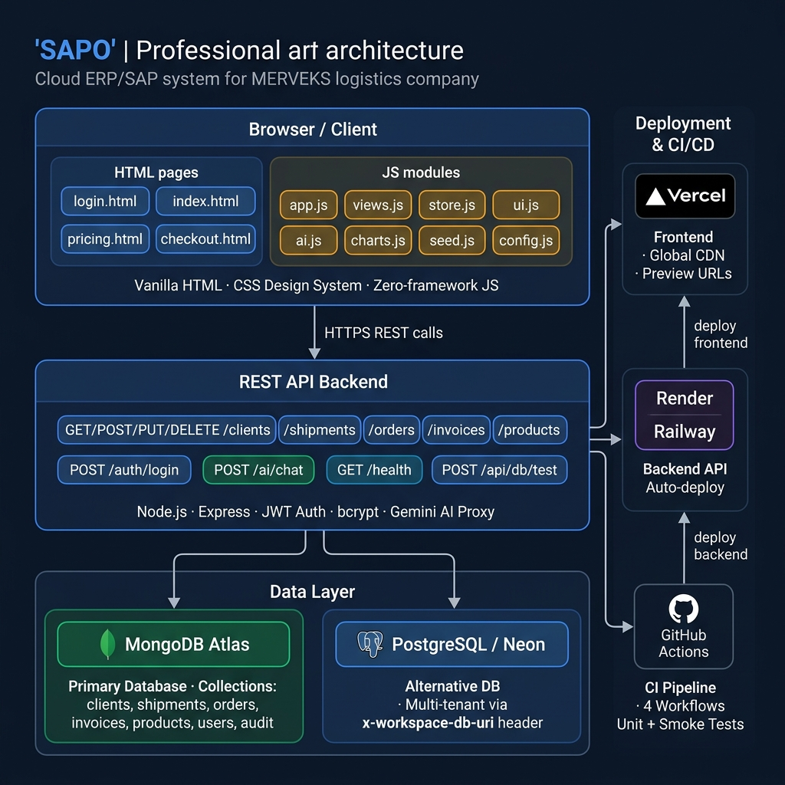

<div align="center">


# SAPO — Smart Operations Platform

**The all-in-one cloud ERP console for [MERVEKS](https://www.merveks.com/en/main-page/) — logistics, trade & supply chain**  
*Mersin · Istanbul · Global*

[](https://github.com/hamzax180/sapo/actions/workflows/ci.yml)
[](https://github.com/hamzax180/sapo/actions/workflows/deploy.yml)
[](https://vercel.com)
[](https://nodejs.org)
[](https://mongodb.com)
[](LICENSE)

[**Live Demo →**](https://merveks-sap.vercel.app/login) &nbsp;|&nbsp; [**API Docs →**](#-api-reference) &nbsp;|&nbsp; [**Architecture →**](#-architecture)

</div>

---

## ✨ Overview

**SAPO** (Smart Adaptive Platform for Operations) is a full-stack, multi-tenant ERP console purpose-built for MERVEKS — a Mersin-based logistics and trade company operating railway, road, and sea freight corridors across Turkey, Russia, and Central Asia.

It replaces fragmented spreadsheets and legacy tools with a **single, real-time operations screen** — shipment tracking, inventory, orders, finance, client & supplier management — with a complete audit trail and a built-in AI assistant.

> **Zero-framework frontend.** No React, no build step, no webpack. Pure HTML + CSS design system + vanilla ES2022 modules. Opens instantly on any device.

---

## 🖥️ Architecture



```
┌─────────────────────────────────────────────────────────────────┐
│                     BROWSER  (Client Layer)                      │
│                                                                  │
│  login.html   index.html   pricing.html   checkout.html         │
│                                                                  │
│  ┌──────────┐ ┌──────────┐ ┌──────────┐ ┌──────────┐          │
│  │  app.js  │ │ views.js │ │ store.js │ │   ui.js  │          │
│  │ (router) │ │(all pages)│ │(data lyr)│ │(kit+auth)│          │
│  └──────────┘ └──────────┘ └──────────┘ └──────────┘          │
│  ┌──────────┐ ┌──────────┐ ┌──────────┐ ┌──────────┐          │
│  │  ai.js   │ │charts.js │ │ seed.js  │ │config.js │          │
│  │(AI chat) │ │(SVG chrt)│ │(demo data│ │(API URL) │          │
│  └──────────┘ └──────────┘ └──────────┘ └──────────┘          │
│                   Vanilla HTML · sap.css · Zero-framework        │
└──────────────────────────┬──────────────────────────────────────┘
                           │ HTTPS REST / JSON
                           ▼
┌─────────────────────────────────────────────────────────────────┐
│                  REST API BACKEND (Node.js / Express)            │
│                                                                  │
│  GET  /health                   POST /auth/login                 │
│  GET|POST  /:collection         POST /ai/chat  (Gemini proxy)   │
│  GET|PUT|DELETE /:collection/:id                                 │
│  POST /api/db/test              POST /api/db/seed               │
│                                                                  │
│  JWT Auth · bcrypt · CORS · Collection allowlist · AI proxy     │
│  Multi-DB routing via  x-workspace-db-type  request header      │
└──────────────┬────────────────────────────┬─────────────────────┘
               │                            │
               ▼                            ▼
┌──────────────────────┐      ┌─────────────────────────┐
│    MongoDB Atlas     │      │   PostgreSQL / Neon DB   │
│  (Primary Default)   │      │ (Alternative, per-tenant)│
│                      │      │                          │
│  clients  shipments  │      │  Same schema, different  │
│  orders   invoices   │      │  driver — selected by    │
│  products users      │      │  x-workspace-db-uri      │
│  audit    suppliers  │      │  header at runtime       │
└──────────────────────┘      └─────────────────────────┘

CI / CD  ──────────────────────────────────────────────────────────
  GitHub Actions ──► Vercel (frontend, global CDN, preview URLs)
  GitHub Actions ──► Render / Railway (backend API, auto-deploy)
```

---

## 🗂️ Modules

| Module | Description |
|--------|-------------|
| 📊 **Dashboard** | Live KPIs — active shipments, open orders, inventory value, receivables. In-transit list, service mix donut, low-stock alerts, recent activity feed |
| 🚢 **Shipments** | Railway / road / sea freight — track status, routes, containers (28 t loads), documents, QR codes; advance status; full CRUD |
| 📦 **Inventory** | Nano-Z Coating & Food Supply stock across warehouses, reorder thresholds, low-stock flags |
| 🛒 **Orders** | Purchase orders with line items, totals, approval workflow |
| 👥 **Clients** | Multinational accounts, ratings, order counts, contact management |
| 🏭 **Suppliers** | Procurement & sourcing partners |
| 💰 **Finance** | Invoices, receivables, mark-paid, overdue tracking, payment QR |
| 🤖 **AI Assistant** | Built-in Gemini-powered chat — query your ERP with plain language; offline fallback when key not set |
| 📋 **Activity History** | Full audit trail of every create / update / delete / sign-in; filterable & searchable |
| ⚙️ **Settings** | Backend connection, database type, team & access, reset demo data |

---

## 🚀 Quick Start

### Run the Frontend (Demo Mode — no backend needed)

```bash
# Serve the public/ folder with any static server
cd public
python -m http.server 8080
# → open http://localhost:8080/login.html
```

**Demo credentials:**

| Role | Email | Password |
|------|-------|----------|
| Owner | `admin@merveks.com` | `merveks2013` |
| Operations | `operations@merveks.com` | `merveks2013` |
| Finance | `finance@merveks.com` | `merveks2013` |
| Trade Specialist | `trade@merveks.com` | `merveks2013` |

### Run the Full Stack (Frontend + Backend + MongoDB)

```bash
# 1. Clone
git clone https://github.com/hamzax180/sapo.git
cd sapo

# 2. Set up backend
cd server
cp .env.example .env
# Edit .env — set MONGODB_URI, JWT_SECRET, GEMINI_API_KEY

# 3. Install & seed
npm install
npm run seed

# 4. Start API server
npm start
# API running at http://localhost:4000

# 5. Open frontend
# Open public/login.html in your browser
# Go to Settings → Backend Connection → enter http://localhost:4000
```

---

## 📐 Project Structure

```
sapo/
├── .github/
│   └── workflows/
│       ├── ci.yml                # Lint + tests + security — every push & PR
│       ├── deploy.yml            # Production deploy to Vercel + backend
│       ├── preview.yml           # PR preview deploy + URL comment
│       └── dependency-update.yml # Weekly auto-update PRs
│
├── public/                       # Frontend (zero-framework, static)
│   ├── index.html                # App shell — sidebar + topbar + view
│   ├── login.html                # Marketing + sign-in landing
│   ├── signup.html               # New workspace signup
│   ├── pricing.html              # Pricing page
│   ├── checkout.html             # Checkout + payment QR
│   ├── css/
│   │   └── sap.css               # Corporate navy design system (53 KB)
│   ├── assets/
│   │   ├── favicon.svg
│   │   └── docs/                 # Client guides (EN + TR PDF)
│   └── js/
│       ├── config.js             # API base URL + company config
│       ├── app.js                # Boot, auth guard, sidebar, router
│       ├── store.js              # Data layer — live/demo, CRUD, audit logging
│       ├── views.js              # All module screens (~280 KB)
│       ├── ui.js                 # Auth + UI kit — icons, modals, toasts, drawer
│       ├── ai.js                 # AI chat panel + Gemini integration
│       ├── charts.js             # Dependency-free SVG charts
│       ├── seed.js               # Full MERVEKS demo dataset
│       ├── industries.js         # Industry/sector reference data
│       ├── workflow.js           # Approval workflow engine
│       ├── tour.js               # Guided onboarding tour
│       ├── perf.js               # Performance monitoring
│       └── vendor/
│           ├── qrcode.min.js
│           └── html5-qrcode.min.js
│
└── server/                       # Backend (Node.js / Express)
    ├── index.js                  # Express app — routes, auth, AI proxy
    ├── db.js                     # MongoDB connection
    ├── db-adapters.js            # MongoDB + PostgreSQL adapter layer
    ├── seed.js                   # Database seeder (hashes passwords)
    ├── unit-test.js              # Mocked unit tests (no real DB)
    ├── smoke-test.js             # Integration tests (MongoDB in-memory)
    ├── .env.example              # Environment variable template
    └── package.json
```

---

## 🔌 API Reference

All endpoints use JSON. The backend auto-detects `Demo ↔ Live` mode based on the `/health` probe.

### Core Endpoints

| Method | Endpoint | Description |
|--------|----------|-------------|
| `GET` | `/health` | Health probe — used by frontend to detect live backend |
| `POST` | `/auth/login` | Authenticate — returns JWT token + user profile |
| `GET` | `/:collection` | List all records (clients, shipments, orders, etc.) |
| `GET` | `/:collection/:id` | Fetch one record |
| `POST` | `/:collection` | Create record |
| `PUT` | `/:collection/:id` | Update record |
| `DELETE` | `/:collection/:id` | Delete record |
| `POST` | `/ai/chat` | Gemini AI proxy — pass `{ prompt }`, get streamed reply |
| `POST` | `/api/db/test` | Test a database connection |
| `POST` | `/api/db/seed` | Provision a workspace database with starter data |

### Allowed Collections

`clients` · `suppliers` · `products` · `quotes` · `orders` · `shipments` · `invoices` · `purchaseorders` · `bills` · `payments` · `notifications` · `audit` · `users`

### Multi-Database Headers

Send these headers to route requests to a specific database:

```http
x-workspace-id:      my-company
x-workspace-db-type: mongodb | postgres | neon
x-workspace-db-uri:  mongodb+srv://... | postgres://...
```

### Auth Header

```http
Authorization: Bearer <jwt-token>
```

---

## ⚙️ Environment Variables

| Variable | Default | Description |
|----------|---------|-------------|
| `MONGODB_URI` | `mongodb://127.0.0.1:27017` | MongoDB connection string |
| `DB_NAME` | `merveks_sap` | Database name |
| `PORT` | `4000` | API server port |
| `JWT_SECRET` | *(required in prod)* | Token signing secret — must be long & random |
| `CORS_ORIGIN` | `*` | Allowed CORS origins (comma-separated in prod) |
| `GEMINI_API_KEY` | *(blank = offline)* | Google Gemini API key for AI assistant |
| `GEMINI_MODEL` | `gemini-2.0-flash` | Gemini model version |

---

## 🔄 CI/CD Pipeline

```
Push / PR                         Push to main
    │                                  │
    ▼                                  ▼
┌────────────────────────┐    ┌──────────────────────────────┐
│    CI  (ci.yml)        │    │     Deploy  (deploy.yml)     │
│                        │    │                              │
│  🔍 Lint (ESLint)      │    │  🧪 Tests (gate)             │
│  🧪 Unit Tests         │    │  🌐 Vercel → Frontend        │
│  🔥 Smoke Tests        │    │  🖥️  Backend → Deploy hook    │
│  🔒 Security Audit     │    │  📣 Slack / Job Summary      │
└────────────────────────┘    └──────────────────────────────┘

Pull Request                      Every Monday
    │                                  │
    ▼                                  ▼
┌────────────────────────┐    ┌──────────────────────────────┐
│  Preview (preview.yml) │    │  Deps (dependency-update.yml)│
│                        │    │                              │
│  🧪 Tests (gate)       │    │  📦 npm outdated check       │
│  🔍 Vercel Preview URL │    │  ⬆️  Auto PR with updates    │
│  💬 PR Comment         │    └──────────────────────────────┘
└────────────────────────┘
```

### Secrets Required

| Secret | Source |
|--------|--------|
| `VERCEL_TOKEN` | vercel.com → Account Settings → Tokens |
| `VERCEL_ORG_ID` | `.vercel/project.json` |
| `VERCEL_PROJECT_ID` | `.vercel/project.json` |
| `BACKEND_DEPLOY_HOOK` | Render / Railway → Deploy Hooks |
| `BACKEND_API_URL` | Your deployed API base URL |
| `SLACK_WEBHOOK_URL` | *(optional)* Slack → Incoming Webhooks |

---

## 🧪 Testing

```bash
cd server

# Unit tests — mocked DB, runs in ~3 seconds
npm test

# Smoke / integration tests — real Express + MongoDB in-memory
npm run smoke-test

# Lint
npm run lint

# Run everything (CI mode)
npm run ci
```

---

## 🚢 Deployment

### Frontend → Vercel

The `public/` folder is deployed automatically to Vercel on every push to `main`. No build step required — it's pure static files.

```bash
# Manual deploy
npx vercel --prod
```

### Backend → Render / Railway / Fly.io

#### Render
1. Create a new **Web Service** pointing to the `server/` directory
2. Set Start Command: `node index.js`
3. Add all environment variables from `.env.example`
4. Copy the **Deploy Hook URL** → add as `BACKEND_DEPLOY_HOOK` secret in GitHub

#### Railway
```bash
cd server
railway login
railway init
railway up
```

#### Fly.io
```bash
cd server
fly launch
fly deploy
```

---

## 🔒 Security Notes

- All passwords are hashed with **bcrypt** before storage — plaintext never hits the database
- JWT tokens are signed with `JWT_SECRET` — use a long random string in production
- The API enforces a **collection allowlist** — unknown routes return `404`
- `GEMINI_API_KEY` is kept server-side — never exposed to the browser
- Demo mode runs entirely client-side in `localStorage` — no data leaves the device
- For production: change `CORS_ORIGIN` to your domain, rotate `JWT_SECRET`, disable the public seed endpoint

---

## 📄 License

MIT © 2024 [MERVEKS](https://www.merveks.com)

---

<div align="center">

Built with ❤️ for MERVEKS logistics operations  
[merveks.com](https://www.merveks.com/en/main-page/) · Mersin, Turkey

</div>
