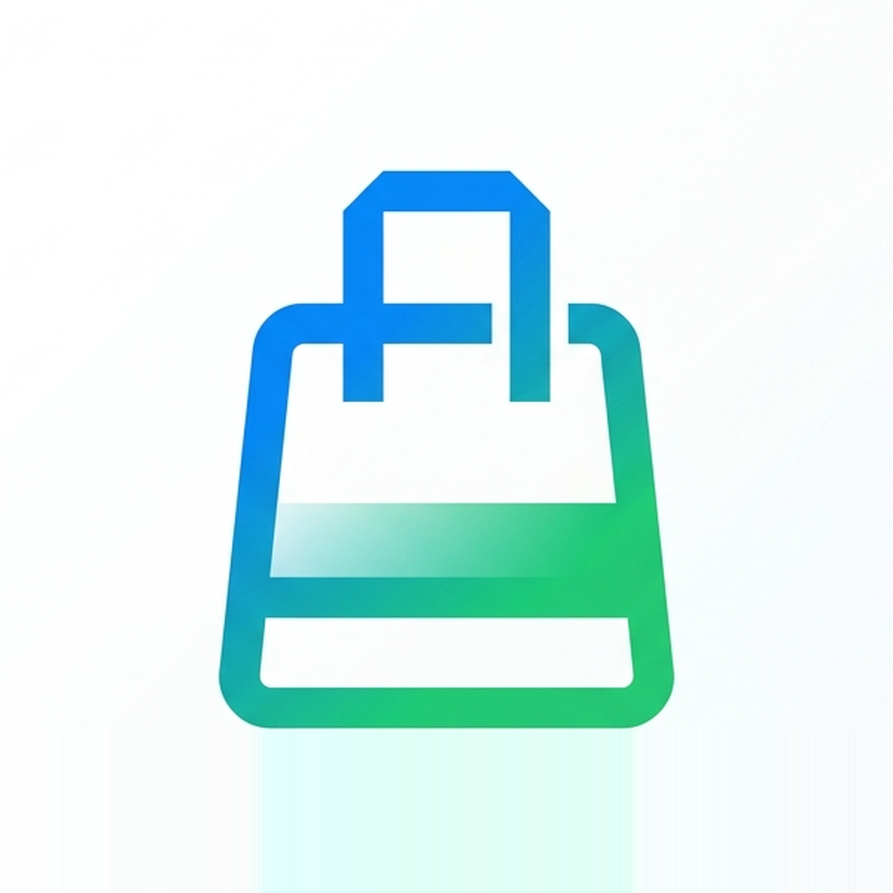

<div align="center">



# Souqi — Smart Commerce & Operations Platform

**The all-in-one cloud operations console and storefront builder.**  

[](https://github.com/hamzax180/sapo/actions/workflows/deploy.yml)
[](https://vercel.com)
[](https://nodejs.org)
[](https://mongodb.com)
[](LICENSE)

[**Live Demo →**](https://souqi.site) &nbsp;|&nbsp; [**API Docs →**](#-api-reference) &nbsp;|&nbsp; [**Architecture →**](#-architecture)

</div>

---

## ✨ Overview

**Souqi** is a full-stack, multi-tenant eCommerce and operations platform designed to help businesses transition from fragmented spreadsheets to a **single, real-time operations screen**. 

With Souqi, businesses can instantly generate their own storefront, manage inventory, track orders, process payments, and connect directly with their suppliers—all accompanied by a complete audit trail and a built-in AI assistant.

> **Zero-framework frontend.** No React, no build step, no webpack. Pure HTML + CSS design system + vanilla ES modules. Lightning fast, beautifully animated, and opens instantly on any device. 

---

## 🖥️ Architecture

The architecture is built for maximum performance and multi-tenancy out of the box.

```text
┌─────────────────────────────────────────────────────────────────┐
│                     BROWSER  (Client Layer)                     │
│                                                                 │
│  login.html   signup.html   index.html   pricing.html           │
│                                                                 │
│  ┌──────────┐ ┌──────────┐ ┌──────────┐ ┌──────────┐            │
│  │  app.js  │ │ views.js │ │ store.js │ │   ui.js  │            │
│  │ (router) │ │(all pages)│ │(data lyr)│ │(kit+auth)│            │
│  └──────────┘ └──────────┘ └──────────┘ └──────────┘            │
│                                                                 │
│                   Vanilla HTML · sap.css · Zero-framework       │
└──────────────────────────┬──────────────────────────────────────┘
                           │ HTTPS REST / JSON
                           ▼
┌─────────────────────────────────────────────────────────────────┐
│                  REST API BACKEND (Node.js / Express)           │
│                                                                 │
│  JWT Auth · bcrypt · CORS · Collection allowlist · AI proxy     │
│  Multi-DB routing via x-workspace-db-type request header        │
└──────────────┬────────────────────────────┬─────────────────────┘
               │                            │
               ▼                            ▼
┌──────────────────────┐      ┌─────────────────────────┐
│    MongoDB Atlas     │      │   PostgreSQL / Neon DB  │
│  (Primary Default)   │      │ (Alternative, per-tenant)│
└──────────────────────┘      └─────────────────────────┘
```

---

## 🗂️ Core Modules

| Module | Description |
|--------|-------------|
| 📊 **Dashboard** | Live KPIs — active orders, inventory value, receivables. |
| 🚢 **Shipments** | Track status, routes, loads, and advance tracking updates in real-time. |
| 📦 **Inventory** | Automated stock tracking, reorder thresholds, low-stock flags across multiple warehouses. |
| 🛒 **Orders & Commerce** | Customer purchase orders, cart integrations, and payment tracking. |
| 👥 **Clients & CRM** | Multinational accounts, ratings, order counts, and contact management. |
| 🏭 **Suppliers** | Procurement & sourcing partners management. |
| 💰 **Finance** | Invoices, receivables, mark-paid, overdue tracking, and dynamic pricing rules. |
| 🤖 **AI Assistant** | Built-in Gemini-powered chat — query your platform with plain language. |
| 🌐 **Localization** | Built-in complete support for English, Arabic (RTL), and Turkish. |

---

## 🚀 Quick Start

### Run the Frontend (Demo Mode — no backend needed)

You can run the web app immediately without any backend dependencies. Souqi's frontend is fully independent.

```bash
# Serve the public/ folder with any static server
cd public
python -m http.server 8080
# → open http://localhost:8080/login.html
```

---

## 🔗 Live Site
Check out the fully operational live platform at **[souqi.site](https://souqi.site)**. 

Experience the interactive device animations, seamless language switching (including deep Arabic RTL support), and responsive design directly from your browser.

---

## 🔒 Security Notes

- Passwords are unconditionally hashed with **bcrypt** before storage.
- JWT tokens are signed securely and verified upon every protected request.
- The API enforces a strict **collection allowlist**—unknown or unauthorized routes return `404` immediately.
- `GEMINI_API_KEY` is kept exclusively server-side and never exposed to the client.
- **Demo mode** operations run entirely client-side leveraging `localStorage`—no sensitive local testing data ever leaves the device.

---

## 📄 License

MIT © 2026 Souqi Cloud Operations Platform
