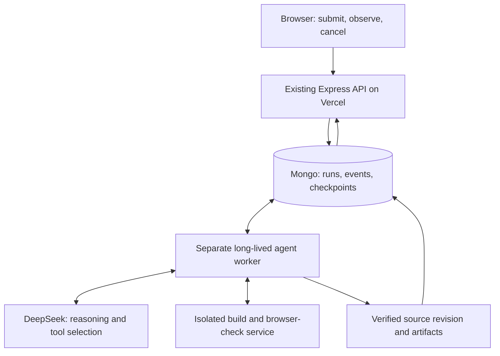

# A durable, adaptive coding agent for Souqi

Status: researched proposal; application changes are not implemented.
Research date: 16 September 2026. Repository inspected: `23cdd57`.

## 1. Decision

Keep DeepSeek. Change the system that runs it.

Move coding work out of the lifetime of `/api/codeagent/build` into a persistent worker. Let the model choose successive actions, observe tool results, repair problems, and propose completion. Souqi accepts completion only when the requested work and the applicable checks are satisfied.

The browser observes the run and can reconnect to it. It must not have to stay open to keep the agent working. Desktop and phone users receive the same server-side build verification.

Effort controls reasoning intensity and the resources available to the run. It is not a target duration or a requirement to exhaust a fixed number of rounds. A simple Max request should finish quickly when it is done; a complex request can continue while it makes useful progress within its budget.

This does not promise DeepSeek will match another model's quality. It gives DeepSeek the execution loop, tools, feedback, and persistence needed to work autonomously.

## 2. What explains the screenshot

The 298-second screenshot is strongly consistent with the repository's 300-second Vercel lifetime. The exact production termination remains unconfirmed: the screenshot supplies no deployment ID, request ID, or function/provider logs. A proxy disconnect or a different deployed version is also possible.

The following defects are confirmed in this checkout:

| Finding | Evidence | Consequence |
|---|---|---|
| One HTTP request owns the entire run | `vercel.json:72`; `backend/index.js:4644` | A long task can disappear when its function is terminated. |
| AI timeout ends at response headers | `backend/lib/ai/client.js:422–469`; BYOK at `519–551` | Waiting for the body can exceed the configured timeout. |
| Deadline is not enforced inside an attempt | `model-loop.js:1829`, `2022`, `2119`, `2193`, `2425`, `2563` | Tool lookups and retries can outlive the outer deadline before any files are returned. |
| Mobile bypasses compilation and repair | `frontend/code.html:440–449`, `1960`; `backend/index.js:5307` | The phone takes `proposeChanges`, not the checked desktop loop. Browser compilation alone cannot explain this screenshot. |
| Generation is constrained to a single batch | `model-loop.js:724`, `737`, `1742`, `2116` | The prompt demands every file in one response; after three lookup rounds the harness forces writing. |
| A normal final answer is rejected | `model-loop.js:1201` | The generation path expects file-writing calls rather than a general inspect/act/finish lifecycle. |
| There is no durable active run | `backend/index.js:5510–5557` | New project identity, user turn, and source revision are saved after successful generation, leaving little to recover from an interrupted first run. |
| Browser feedback is local to one process | `backend/index.js:2642`, `4594` | A callback reaching another instance or a restarted instance cannot find its build waiter. |
| Browser cancellation does not cancel the server run | `frontend/code.html:1609`; no corresponding provider cancellation propagation in the handler | The UI can stop while billable work continues. |
| Stream EOF is treated as task failure | `frontend/code.html:2137` | The exact user-facing message is “No result came back”; no run ID/status query can recover the outcome. |

### Timing, precisely

The nominal turn deadline is 300 seconds minus a 25-second finishing reserve. A Power/Max provider call is allowed 180 seconds. One generation attempt can perform three lookup calls, a forced-write call, and a malformed-output retry: up to five provider calls before the outer repair loop can check its deadline again. Even if the provider timeout worked, those calls can exceed the request lifetime.

The current outer guard runs only after the first round, when files already exist. Passing `deadlineAt` at the route does not impose a timeout on the initial generation. Mobile's `proposeChanges` does not enforce it either.

### Reproduced without a live model

An independent audit called the actual exported production modules with an injected fake HTTP transport. No paid inference, production requests, database changes, or application edits were needed.

| Probe | Expected | Observed |
|---|---|---|
| `client.chat`, timeout 20 ms; headers immediate; abort-aware body delayed 120 ms | Abort near the configured limit | Success after about 128 ms; signal never aborted |
| Mobile `proposeChanges`, deadline 20 ms; body delayed 100 ms | Deadline respected | Success after about 127 ms; no timeout indication |
| Desktop `proposeWithClientBuild`, deadline 20 ms; first body delayed 100 ms | No late compile | Compilation started about 110 ms into the attempt |

Millisecond timings are illustrative; the evidence is that the delayed response completed successfully after its limit. Existing AI-client tests (19) and model-loop tests (133) pass, demonstrating that these cases are missing from the current tests.

## 3. What the official documentation establishes

### DeepSeek

Current thinking documentation says thinking is enabled by default at `high`; it supports explicit effort settings. Tool conversations must preserve the returned `reasoning_content`. Souqi's HTTP payload currently sends neither `thinking` nor `reasoning_effort`, so its Max label does not explicitly select the provider's Max reasoning. Small utility calls should explicitly disable thinking. [DeepSeek thinking mode](https://api-docs.deepseek.com/guides/thinking_mode/)

Active Souqi tool exchanges already preserve whole assistant messages. Do not remove that behavior. The gaps are durable transcript storage, history reconstructed from UI text, and token estimates that ignore retained reasoning.

Streaming returns incremental content/tool data and a terminal reason. Distinguish `stop`, `tool_calls`, `length`, filtering, resource failures, and abortion; an ended socket is not completion. Accumulate and validate tool arguments before execution. [DeepSeek Chat Completions](https://api-docs.deepseek.com/api/create-chat-completion/)

DeepSeek documents blank-line and SSE-comment keepalives during waiting. A live transport is not evidence of model progress, and a headers-only timeout cannot bound body consumption. [DeepSeek rate limits and keepalive](https://api-docs.deepseek.com/quick_start/rate_limit/)

DeepSeek's Responses compatibility does not supply background execution or stored conversations. Changing the API endpoint alone would not provide durable runs. [DeepSeek Responses guide](https://api-docs.deepseek.com/guides/responses_api/)

Model aliases, context/output limits, and prices have changed since the local comments were written. Store the configured and returned model identities, version the capability/pricing configuration, and calculate usage by the selected model. Do not infer current prices from the old route-only table. [Current model details and pricing](https://api-docs.deepseek.com/quick_start/pricing/)

### Claude and Codex patterns

Claude documents a loop of gathering context, taking action, and verifying, with steps selected from prior results. Its long-running-agent guidance emphasizes incremental work and persistent progress artifacts. Those are useful design principles for Souqi. [Claude Code execution](https://code.claude.com/docs/en/how-claude-code-works), [Long-running agent harnesses](https://www.anthropic.com/engineering/effective-harnesses-for-long-running-agents)

Codex documents separate thread, turn, and item lifecycles, streamed progress, and explicit completed/interrupted/failed outcomes. OpenAI also documents asynchronous response execution with polling. These are reference patterns, not features that become available to DeepSeek through an OpenAI-compatible URL. [Codex app server](https://learn.chatgpt.com/docs/app-server), [OpenAI background execution](https://developers.openai.com/api/docs/guides/background)

### Hosting

Vercel counts waiting and streaming toward function duration. Current documentation offers longer limits on eligible plans, but this repository explicitly sets 300 seconds. Raising that limit can create temporary headroom; it does not provide saved state or recovery. Vercel Workflows is a credible managed alternative for durable execution. [Function duration](https://vercel.com/docs/functions/configuring-functions/duration), [Workflows](https://vercel.com/docs/workflows)

## 4. Recommended architecture



Use the existing Mongo platform store for agent runs. Keep deployment Postgres responsible for deployments. Initially, atomic Mongo claims are enough; adding Redis or a new queue vendor is unnecessary.

Package the orchestrator as a separate process using extracted backend modules. It can initially run on the existing VPS with conservative concurrency after capacity is measured. It must not run inside the Docker-privileged deployment worker. A separate builder host is preferable as load or the allowed tool surface grows.

Keep the existing deployment operation separate: `pipeline.deploy()` builds, swaps live containers, provisions resources, and creates public routes. It is not a safe substitute for a build-check tool. Successful coding never implicitly deploys a user's project.

### Alternatives considered

| Option | Assessment |
|---|---|
| Raise Vercel duration | Useful temporary mitigation if the account supports it; still request-bound. |
| Mongo-backed worker on existing VPS | Recommended starting point: reuses current data and infrastructure; requires leases, recovery, and operational supervision. |
| Vercel Workflows | Viable managed alternative; prototype integration, pricing, and sandbox needs before choosing it. |
| Migrate to DeepSeek Responses only | Does not solve execution lifetime or application persistence. |
| Remove all limits | Does not solve recovery and can create runaway costs or endless retries. |

## 5. The dynamic execution loop

Replace the separate “lookup, write once, repair N times” pattern with one loop:

1. Load the original request, acceptance checklist, current source snapshot, and saved transcript.
2. Ask the model for its next action or final answer using the selected reasoning configuration.
3. Parse the terminal reason and all complete tool calls.
4. Execute valid tools, record every outcome, and update the candidate source.
5. Feed actual tool outcomes back to the model.
6. When the model proposes finishing, validate the current source and requested behavior.
7. Finish when checks pass; otherwise return actionable feedback and continue while progress and budget allow.

A model response ends an inference call. It does not necessarily end the user's run. `length` means interrupted generation, not success. An empty `stop` response is not a final answer.

### Initial tool surface

- Reuse restricted `read_file`, `search_code`, `write_file`, and `edit_file`.
- Add `list_files`, a structured progress/checklist update, `check_project`, and a narrow preview inspection tool.
- Let `check_project` run fixed scaffold commands for type checking and production building; return structured errors and artifact identity.
- Accept a natural final response as a completion proposal. Do not force an always-required tool call, which would prevent normal completion.
- Give every tool call a durable ID and result, including a refusal or validation error. Preserve assistant/tool message pairing.

Remove the instruction requiring the whole app in one response only when the incremental loop exists. Removing it in today's harness would recreate the missing-entry-file bug. Preserve entry-file/path protections and require every linked page before accepting a finished website.

### Completion contract

For a coding run, mark `succeeded` only when:

- The candidate source is saved and has a stable hash.
- Required entry points, imports, and navigation targets exist.
- Type checking and the production build passed for that exact hash.
- Relevant runtime/browser checks passed or their limitations are stated explicitly.
- The request checklist is addressed with evidence; compilation alone cannot prove functionality.
- The final revision and response are durably recorded.

For the restaurant request, the checklist should include each requested HTML page, working navigation, mobile layout, menu/cart/order interactions, and the exact restaurant name. An order UI must not be described as sending real orders unless a real destination/service is configured and verified.

Information-only turns can finish without files. Missing essential information produces `waiting_for_user`; an external blocker produces `blocked`. Budget exhaustion saves `partial`. User cancellation produces `cancelled`. These are distinct from success.

### Progress and limits

Keep per-call transport/idle limits, per-tool limits, spend limits, cancellation, and an emergency run ceiling. These are safeguards, not completion targets. Do not use a timer to force a successful label.

Detect repeated identical source/errors and unsuccessful strategies, but allow investigation that produces new evidence. Warn the model about a stall, permit a bounded alternative, then preserve the partial result and name the blocker. A repeated error is not automatically proof that no useful work occurred.

## 6. Provider transport and effort

Create a capability-aware DeepSeek adapter rather than passing every provider identical fields.

- Serialize explicit thinking/effort settings for DeepSeek, including BYOK.
- Use non-thinking for bounded routing/classification and short metadata tasks.
- Stream model responses; handle SSE comments, chunk boundaries, incremental tool arguments, usage, and terminal reasons.
- Keep abort and timeout handling active through body consumption; clean up in `finally`.
- Separate connection liveness from inference activity and completed work.
- Preserve the exact assistant protocol message for replay, including provider-required reasoning. Keep this internal; user progress should describe actions/results rather than dump raw reasoning.
- Count retained reasoning and tool schemas in context estimates.
- Preserve error code, HTTP status, provider request ID, timeout phase, and retryability through the orchestration layers.
- Retry transient transport/rate-limit/resource errors with bounded backoff. Do not rewrite code to repair an infrastructure error or retry invalid credentials as though they were transient.

Suggested starting policy, to benchmark rather than treat as proven optimal:

| UI effort | Initial provider policy | Execution policy |
|---|---|---|
| Fast | Flash; disabled or low thinking | Smaller allowance; same correctness contract |
| Balanced | Flash; explicit high thinking | Default adaptive loop |
| Smart | Configured stronger model; high thinking | More reasoning/checking allowance |
| Max | Configured stronger model; explicit max thinking | Largest bounded allowance; stop early when complete |

Keep a finite output-token cap per inference. Prefer coherent incremental edits rather than requesting the maximum output every time. Tune caps against observed reasoning/output use: reasoning consumes budget too. Increasing a token ceiling does not improve a request that is waiting forever for its body.

## 7. Durable state and API contract

Proposed routes:

```text
POST /api/codeagent/runs                   -> 202 {runId, projectId, status}
GET  /api/codeagent/runs/:id                -> authoritative state and result
GET  /api/codeagent/runs/:id/events?after=N -> replay + bounded SSE subscription
POST /api/codeagent/runs/:id/cancel         -> durable cancel request
POST /api/codeagent/runs/:id/resume         -> continue a resumable checkpoint
```

Reserve these routes ahead of the existing `/api/codeagent/:key` route or use an explicit router so `runs` cannot be treated as a project key. Every operation must check the same owner/project authorization. Never treat an unguessable ID alone as authorization.

### Store design

- `agent_runs`: owner, project/chat, original request, request hash/idempotency key, pinned base revision/scaffold, model/policy versions, state/phase, budget, cancellation, checkpoint/result references, lease, and timestamps.
- `agent_events`: unique `(runId, sequence)` entries for progress and state changes; retained separately from the run document.
- `agent_steps`: transcript/tool intents/results, provider usage, operation IDs, and request/response status. Bound document size; use external artifact references for large content.
- `agent_checkpoints`: immutable complete source snapshot or content-addressed manifest, transcript pointer, checklist, validation results, and latest known-good candidate.

Persist the user request and run identity before work begins. Durable mode requires Mongo availability; never silently fall back to process memory while advertising recovery. Retain full requested scope within validated limits instead of relying on the current truncated display-history fields.

### Recovery rules

1. Atomically claim work with a lease. As an initial operational setting, refresh every 10 seconds with a 30-second lease, then tune against real pauses.
2. Increment a fencing generation on takeover. Every state/artifact commit must prove current ownership; an old worker cannot publish after its lease is lost.
3. Checkpoint after each completed provider response and applied tool batch, and before/after verification. Never execute a partial tool JSON fragment.
4. Record tool intent before execution and its outcome afterward. Reuse the same operation ID on retries. Reconcile uncertain side effects instead of assuming exactly-once execution.
5. Persist a canonical terminal state and idempotent final result before notifying clients. Replayed events may be duplicated; revision commits and billable run submission must not be.
6. On provider interruption, resume from the last complete protocol/checkpoint boundary. Do not promise continuation of a lost, in-flight model response or zero repeated provider cost.
7. On worker shutdown, stop claiming new jobs, checkpoint where possible, and let leases recover unfinished work.

Use an outbox or transaction for state/event consistency; if a terminal notification is lost, `GET run` must still expose the terminal result. Resume and polling must not themselves make new model calls.

### Source consistency

Serialize mutating runs per project initially, including runs from different chats. Pin the base revision and commit with compare-and-swap; a moved head requires rebase/revalidation or an explicit conflict.

Current source revisions are deltas and pruning retains only 50 (`projects.js:25`, `356–383`, `411–455`). Add full snapshots before pruning; a durable checkpoint must not depend on a deleted ancestor containing a file's only copy. Keep the published revision separate from unfinished candidate work.

## 8. Verification on desktop and mobile

Add a build-only service behind a narrow authenticated interface. Inputs identify the owned run, immutable source/scaffold hash, attempt, and fixed check type. Results identify exactly the same source hash.

Run generated code in disposable sandboxes with CPU, memory, process, disk, output, and execution limits. No model credentials, platform database access, Docker socket, or production user secrets enter a generated app's sandbox. Separate controlled dependency fetching from restricted build/test execution where practical.

The existing runtime abstraction is a useful seam (`backend/lib/codeagent/runtime.js`). The old local runtime is not a production security boundary. Existing deployment runtime restrictions should be reviewed and adapted; the current Docker image-building command does not automatically inherit them.

Both device classes use this verification service. WebContainers can remain an optional fast local preview. A phone's inability to compile must no longer skip repairs or be counted as verified success.

Browser smoke tests should inspect the built artifact in isolation, capture exceptions/blank renders, and exercise relevant interactions. Visual checks and a checklist complement the compiler; neither can prove every possible behavior.

## 9. Frontend behavior

- Show queued/running/checking/repairing/reconnecting states and the latest real action.
- Replace “Thought for N seconds” with “Working for N seconds” unless actual reasoning timing is measured. Current elapsed time also includes network, tools, and compilation.
- Render saved file changes incrementally and distinguish a draft preview from a verified result.
- Reconnect after the last event sequence; deduplicate repeated events. Query run status on EOF, network loss, page reload, and mobile resume.
- Send lightweight heartbeats while subscribed; rotate SSE connections below the request limit. Reconnection has no effect on the worker's lifetime.
- Treat closing a tab as detaching. Treat Stop as an authenticated persisted cancellation, acknowledged only after the worker stops or is fenced from further work.
- For partial outcomes, show what was saved, the actual blocker, and Continue from the checkpoint. Never replace the user's app with an unrelated template and call the task complete.
- Preserve existing Plan mode: review its concrete plan before queueing execution. Auto mode continues within the request without extra approval steps.

## 10. Budgets and observability

An adaptive loop needs stronger accounting than checking spend once at the beginning and recording it at the end.

Reserve owner/platform allowance atomically before each model call, settle observed usage afterward, and retain a conservative reservation when usage is unknown. Track retries and BYOK separately. Use current model-aware pricing, including cache usage, rather than assuming all routes cost the same.

Log structured metadata per run and step: configured/returned model, effort, prompt version, headers/first-token/completion times, phase, tool result, source hash, usage, termination reason, and recovery count. Avoid credentials, raw reasoning, and user source in ordinary logs.

Track completion rate, partial/failed/cancelled rates, p50/p95 first-useful-progress and completion latency, repair count, cost per verified result, mobile/desktop parity, and the frequency of lost/recovered connections. A template fallback is not a successful task.

## 11. Delivery sequence

### Phase 0 — establish the production trace

Correlate a failing request with its deployment version, function termination, upstream request, device capability, and last phase. This confirms which known defect caused the screenshot. Add the deterministic timeout/deadline probes as regression tests.

### Phase 1 — make the existing path fail predictably

Files: `backend/lib/ai/client.js`, `backend/lib/ai/anthropic.js` as needed, `backend/lib/codeagent/model-loop.js`, `backend/index.js`, `frontend/code.html`.

- Fix the full-response timeout and propagate one deadline/cancel signal through every call, retry, utility task, and build wait.
- Check remaining time before the first attempt too. Cap every operation to the remaining allowance and preserve a finishing reserve; remove minimum waits that can exceed it.
- Preserve completed candidate work and truthful `partial`/`unverified` reasons; do not lose these fields in the route response.
- Add explicit DeepSeek effort policy and concise phase telemetry; treat provider-default changes as configuration changes.
- Distinguish connection loss from generation failure. Until durable runs ship, do not claim disconnected work is recoverable when it is not.

This is containment, not the final dynamic-agent architecture. Raising Vercel duration is optional and account-dependent.

### Phase 2 — persistent runs and recovery

Proposed modules: `backend/lib/codeagent/run-store.js`, `run-service.js`, `run-events.js`, and `backend/worker/codeagent-worker.js`; separate worker packaging under `infra/agent/`.

Extract orchestration from the Express handler without importing a server-starting entry point into the worker. Add run APIs, ownership/idempotency, leases/fencing, checkpoints, source snapshots, spend accounting, cancellation, replay, and frontend reconnect. Ship behind a feature flag using the existing constrained generation logic first.

### Phase 3 — server verification

Add sandbox build-only jobs and a runtime adapter. Pin scaffold/dependencies, return checks tied to source hashes, and make desktop and mobile use the same path. Keep preview and deployment as separate operations.

### Phase 4 — adaptive tool loop

Replace forced one-batch generation and fixed repair-round completion with the unified loop. Add normal final-answer handling, checklist/verification completion gates, provider streaming, protocol checkpoints, safe context compaction, and progress-aware stall handling. Compaction must preserve outstanding tool exchanges and provider-required reasoning; old UI summaries are context, not fabricated protocol history.

### Phase 5 — evaluate and roll out

Use a fixed suite of realistic first builds and edits, including the restaurant request. Compare all effort levels and mobile/desktop runs. Expand gradually while measuring verified task success, cost, latency, and recovery. Keep rollback for new submissions while allowing already-started runs to finish on their pinned runner version.

The feature flag must not create two active execution paths for one request. Deploy compatible API/frontend, worker, and sandbox versions in a staged order and verify each target with a version marker.

## 12. Acceptance tests

| Scenario | Required outcome |
|---|---|
| Immediate headers, stalled body | Full-response timeout aborts and classifies the failure. |
| Long first reasoning/tool attempt | Deadline applies before and during the first attempt. |
| Provider keepalives without inference | UI reports waiting; bounded recovery; no invented progress. |
| Reasoning + tools across several calls | Required protocol fields and tool replies survive replay. |
| Model ends with a valid final response | Finish if relevant checks pass; no forced extra write. |
| Token truncation or incomplete tool JSON | Preserve complete checkpoints; do not execute fragments or label complete. |
| Task takes longer than 300 seconds | Worker continues; browser subscription reconnects to the same run. |
| Close/reopen browser; suspend phone | Run persists and resumes observation without duplicate work. |
| Worker crash around a tool/commit | Lease recovery; stale worker fenced; no duplicate revision or charge record. |
| Retry identical run POST | Same owner/idempotency key returns the same run. |
| Two edits to one project | Serialized execution or explicit conflict; no lost files. |
| Stop during inference/build | Work stops, checkpoint remains, and no late result replaces the cancelled state. |
| Budget exhausted or no progress | Honest partial/blocked result with continuation point. |
| Over 50 source revisions | Untouched early files survive pruning through snapshots. |
| Mobile restaurant build | Same build and interaction checks as desktop. |
| Build passes but requested page/action is absent | Completion gate rejects it and gives actionable feedback. |
| Other owner's run ID/source/job result | Access denied; ownership cannot be selected by a client header. |

The central success criterion is: a connection ending must never be the only record of what happened to a coding task.
